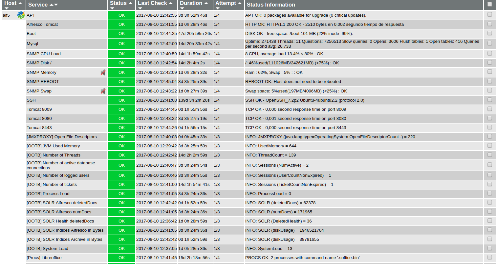

# Nagios setup for Alfresco Community

## Introduction

A well known example for Alfresco monitoring via JMX is available [here](https://github.com/toniblyx/alfresco-nagios-and-icinga-plugin) but the most interesting information of this plugin is for Enterprise Edition (EE), although general direct monitoring commands (not JMX-based) may be used for Community Edition (CE) too. For example:

- check_ssh for direct monitorization of ssh port
- check_http for direct monitorization of http(s) service (like 80 or 443)
- check_tcp for checking Tomcat and Alfresco ports (like 8009, 8080, 8443 or 50500)

Additionally you may use other Nagios common plugins depending on your monitorization strategy:
- check_snmp for checking CPU, RAM, Load & Swap (via standard SNMP protocol) if using SNMP protocol
- check_esxi for checking CPU, RAM, Load from VMware API point of view (if your instance is virtualized)

Also an important thing to monitor in Alfresco server is related to disk sizes (and inodes) for contentstores, Tomcat temp, Alfresco logs, Solr indices, and Solr backup indices.. and also processes like Libreoffice too. 

Finally other plugins may be useful depending on your Alfresco stack:
- check_mysql for monitoring your database pool connections (in case of Mysql)
- check_tomcat for monitoring threads and JVM 
- check_jmx or Jolokia for monitoring JMX variables  

### OOTB Support Tools helper for monitoring


 
With [OOTB Support Tools addon for Alfresco Community Edition](https://github.com/OrderOfTheBee/ootbee-support-tools), it is possible to extract useful information about JVM, threads, logged users or SOLR via curl command, for generating alerts and graphs in Nagios. We can use the JSON information from the available webscripts of the addon:

- JVM Used Memory
- Number of Threads
- Number of active database connections
- Number of logged users
- Number of tickets
- Process Load
- System Load
- SOLR numDocs (for any core)
- SOLR deletedDocs
- SOLR Health
- SOLR indices size (for any core)

### JMX information

With JMXProxy servlet, you may get JMX information about Garbage Collector, Memory, Threads or Operating System in your Tomcat instance. The essential info may be obtained from OOTB Support Tools webscripts too, but other important parameters from Operating System or Garbage Collector may be extracted this way. Please note that this JMX information is related to the default mbeans in a Tomcat container, and not related to the Alfresco JMX objects contained in Alfresco Enterprise (aka Alfresco Content Services). For illustrating this, we will monitor the number of opened file descriptors in the operating system. It is also an alternative to [Jolokia](https://jolokia.org/tutorial.html) or check_jmx methods.

## Nagios-Icinga configuration

The files involved in Nagios/Icinga configuration are the following:

- hosts.cfg (Alfresco host definition)
- ootb-commands.cfg (Nagios commands)
- services_ootb.cfg (Non NRPE services)
- nrpe_ootb.cfg (NRPE services)
- nrpe.cfg (For nrpe-server - only if NRPE)

By the way, shell scripts are usually placed at /usr/lib/nagios/plugins/

- check_ootb_active_sessions.sh
- check_ootb_performance_stats.sh
- check_ootb_solr.sh
- check_manager_jmxproxy.sh (JMX monitoring)

For using this setup you need some dependencies like curl and jshon in your Nagios Server. In Ubuntu 16.04 LTS, for example:

```
$ sudo apt-get install curl jshon
```

Note: If you plan to use NRPE config, you need to configure your Alfresco Server as a Nagios NRPE server.

## Alfresco configuration

For consuming OOTB webscripts, you need to create a dedicated user for Alfresco Monitoring, for example monitor, with admin rights (belonging to ALFRESCO_ADMINISTRATORS group). Take into consideration that this password is used in Nagios scripts. You should use SSL in http requests, or running monitoring processes locally in Alfresco server via NRPE protocol (safer). Previously you need to install OOTB Support Tools addon in your Alfresco server.

### Enabling JMXProxy servlet

If you use the default installer in Alfresco, the Tomcat manager application is deployed under webapps directory. You may enable JMXProxy servlet for monitoring JMX variables in Alfresco Community: 

- Create $ALF_HOME/tomcat/conf/Catalina/localhost/manager.xml

```
<Context antiResourceLocking="false" privileged="true" useHttpOnly="true" 
override="true">
  <Valve className="org.apache.catalina.authenticator.BasicAuthenticator" securePagesWithPragma="false" 
/>
</Context>

```

- Edit credentials and roles for manager user at $ALF_HOME/tomcat/conf/tomcat-users.xml

```
<tomcat-users>
  <user username="CN=Alfresco Repository Client, OU=Unknown, O=Alfresco Software Ltd., L=Maidenhead, ST=UK, C=GB" roles="repoclient" password="null"/>
  <user username="CN=Alfresco Repository, OU=Unknown, O=Alfresco Software Ltd., L=Maidenhead, ST=UK, C=GB" roles="repository" password="null"/>
  <role rolename="manager-jmx"/>
  <user username="monitor" password="secret" roles="manager-jmx"/>
</tomcat-users>
```

Finally you need to restart Alfresco service. And for checking it you can type:

```
curl -u monitor:secret "http://127.0.0.1:8080/manager/jmxproxy/?get=java.lang:type=OperatingSystem&att=OpenFileDescriptorCount"
```
## Using Dockerfile

You can check this basic Nagios/Icinga setup using Docker.

0. Clone this project
```
$ git clone https://github.com/zylklab/alfresco-nagios
$ cd alfresco-nagios
```

1. Configure Alfresco admin credentials, host, address, and JMXProxy manager credentials in Dockerfile according to your Alfresco repository target to monitor

```
ENV ICINGA_ADMIN admin
ENV ALF_USER admin
ENV ALF_PASS s3cret
ENV ALF_HOST alf5.melmac.net
ENV ALF_ADDR 127.0.0.1
ENV ALF_PORT 8080 
ENV JMX_USER manager
ENV JMX_PASS s3cret
```

2. Run docker commands

```
$ sudo docker build -t zylklab/icingalf .
$ sudo docker run -i -t zylklab/icingalf
```

3. Login http://docker-server-ip/icinga with icingaadmin/admin credentials.

Note: Take into consideration that email alerts are not configured. You should configure postfix and Icinga/Nagios contacts.

## Tested on

- Alfresco 2017XXGA
- OOTB Support Tools Addon >0.1
- Nagios/Icinga 3
- Docker version 1.12.6

## Author

- [Cesar Capillas](http://github.com/CesarCapillas)

## Links

- [Alfresco Nagios Setup for Alfresco Enterprise](https://github.com/toniblyx/alfresco-nagios-and-icinga-plugin)
- [OOTB Support Tools](https://github.com/OrderOfTheBee/ootbee-support-tools)
- [Using the JMX Proxy Servlet](https://tomcat.apache.org/tomcat-7.0-doc/manager-howto.html#Using_the_JMX_Proxy_Servlet)
- [Jolokia tutorial](https://jolokia.org/tutorial.html)
- [Blog Post - Monitoring Alfresco in Nagios via OOTB Support Tools](http://www.zylk.net/es/web-2-0/blog/-/blogs/monitoring-alfresco-in-nagios-via-ootb-support-tools-addon)
- [Blog Post - More on monitoring Alfresco in Nagios via OOTB Support Tools](http://www.zylk.net/es/web-2-0/blog/-/blogs/more-on-monitoring-alfresco-in-nagios-via-ootb-support-tools)
