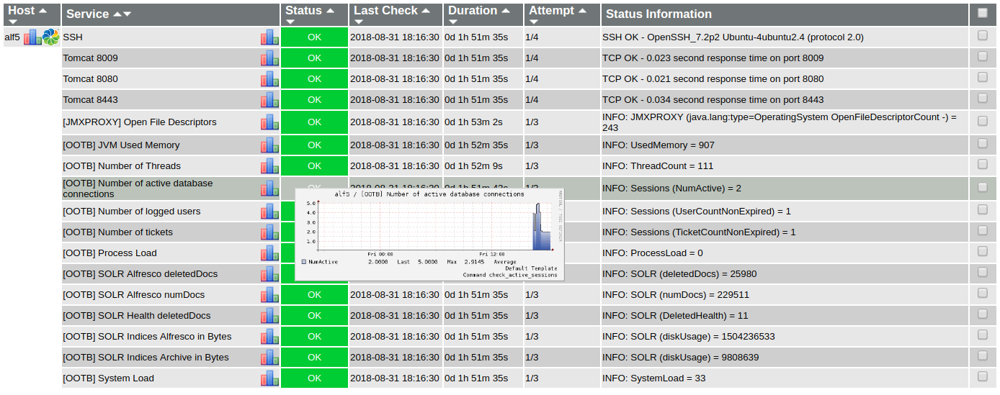
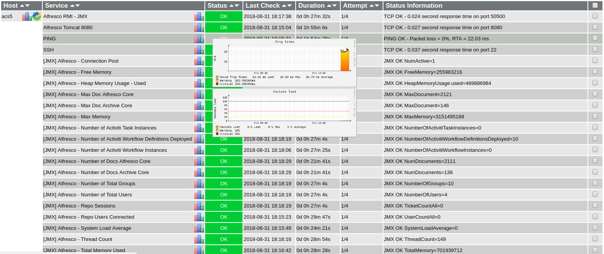

# Nagios setup for Alfresco

## Table of Contents
- [Introduction](#introduction)
- [Nagios-Icinga configuration for Alfresco Community](#nagios-icinga-configuration-for-alfresco-community)
- [Nagios-Icinga configuration for Alfresco Enterprise](#nagios-icinga-configuration-for-alfresco-enterprise)
- [Alfresco Search Services](#alfresco-search-services)
- [Using Docker Template](#using-docker-template)
- [Tested on](#tested-on)
- [Author](#author)
- [Links](#links)

## Introduction

A well known example for Alfresco monitoring via JMX is available [here](https://github.com/toniblyx/alfresco-nagios-and-icinga-plugin), but the most interesting information for this is related to Enterprise Edition (EE). General direct monitoring commands (not JMX-based) may be used for Community Edition (CE) too via OOTB Support Tools webscripts (System Performance, Active Sessions and SOLR).

## Nagios-Icinga configuration for Alfresco Community

### OOTB Support Tools webscripts

With [OOTB Support Tools addon for Alfresco Community Edition](https://github.com/OrderOfTheBee/ootbee-support-tools), it is possible to extract useful information about JVM, threads, logged users or SOLR via curl command. We can use the JSON information from the available webscripts of the addon for generating alerts and graphs in Nagios.

- JVM Used Memory
- Number of Threads
- Number of active database connections
- Number of logged users
- Number of tickets
- Process Load
- System Load
- SOLR numDocs (for any core)
- SOLR deletedDocs
- SOLR Health
- SOLR indices size (for any core)



For consuming OOTB webscripts, you need to create a dedicated user for Alfresco Monitoring, for example monitor, with admin rights (belonging to ALFRESCO_ADMINISTRATORS group). Take into consideration that this password is used in Nagios scripts. You should use SSL in http requests, or running monitoring processes locally in Alfresco server via NRPE protocol (safer).

Previously you need to install [OOTB Support Tools addon](https://github.com/OrderOfTheBee/ootbee-support-tools) in your Alfresco CE server.

The ALF_USER and ALF_PASS are needed in docker-compose.yml template file for Alfresco Community mode MODE=CE. These variables are not needed in the EE mode.

### JMXProxy servlet (legacy)

[With JMX Proxy Servlet](https://tomcat.apache.org/tomcat-7.0-doc/manager-howto.html#Using_the_JMX_Proxy_Servlet) enabled in Alfresco Community, you may get JMX information about Garbage Collector, Memory, Threads or Operating System in your Tomcat instance. The essential info may be obtained from OOTB Support Tools webscripts too, but other important parameters from Operating System or Garbage Collector may be extracted this way. Please note that this JMX information is related to the default mbeans in a Tomcat container, and not related to the Alfresco JMX objects contained in Alfresco Enterprise (aka Alfresco Content Services).

For illustrating this, we will monitor the number of opened file descriptors in the operating system. It is also an alternative to [Jolokia](https://jolokia.org/tutorial.html) or check_jmx methods.

The JMXPROXY_USER and JMXPROXY_PASS in docker-compose.yml template file for Alfresco Community mode MODE=CE. These variables are not needed in the EE mode.

## Nagios-Icinga configuration for Alfresco Enterprise

This set up needs JMX enabled Alfresco Server. For enabling JMX, you can check [Alfresco docs](https://docs.alfresco.com/5.0/tasks/jmx-access.html)



## Alfresco Search Services

Alfresco Search Services (based on SOLR 6.x) are monitored via [check_alfresco_solr.py](https://github.com/alxgomz/nagios-plugin-alfresco-search-services) script by Alexandre Chapellon. The script helps to monitor index, handlers, FTS and caches values. It is valid both for Alfresco Community and Alfresco Enterprise setups.


You may find more details in Alfresco Premier Services blog post:
- [Solr monitoring using Nagios and alikes](https://community.alfresco.com/blogs/alfresco-premier-services/2018/08/08/solr-monitoring-using-nagios-and-alikes)

## Using Docker template

You can check this basic Nagios/Icinga setup using Docker. Previously, you may need to enable JMX in Alfresco Enterprise, and to install OOTB Support Tools addon and to enable JMXProxy servlet in Alfresco Community setups.

0. Clone this project
```
$ git clone https://github.com/zylklab/alfresco-nagios
$ cd alfresco-nagios
```
1. Configure Alfresco template in docker-compose.yml file according to your Alfresco repository target and mode to monitor.

```
version: '3.1'

networks:
  monitoring:

services:
  icinga.zylk.net:
    build: .
    networks:
      monitoring:
    ports:
      - 8888:80
    environment:
      - MODE=CE
      - ALF_HOST=alfresco5ce.zylk.net
      - ALF_PORT=8080
      - ALF_USER=${ALF_USER}
      - ALF_PASS=${ALF_PASSWORD}
      - JMXPROXY_USER=${JMXPROXY_USER}
      - JMXPROXY_PASS=${JMXPROXY_PASS}    
      - ASS_HOST=solr6ce.zylk.net
      - ASS_PORT=8983

      #- MODE=EE
      #- ALF_HOST=alfresco5ee.zylk.net
      #- ALF_PORT=8080
      #- JMX_USER=${JMX_USER}
      #- JMX_PASS=${JMX_PASS}
      #- ASS_HOST=solr6ee.zylk.net
      #- ASS_PORT=8983

    extra_hosts:
      - "alfresco5ce.zylk.net:192.168.1.100"
      - "solr6ce.zylk.net:192.168.1.101"
      #- "alfresco5ee.zylk.net:192.168.1.200"
      #- "solr6ee.zylk.net:192.168.1.201"
```

2. Fire the Icinga container via docker-compose

```
$ docker-compose up
```

3. Icinga login

To access Icinga, point your browser to your docker host IP (probably locahost) at port 8888, with icingaadmin/admin credentials. Note that you can change the port mapping in docker-compose.yml file too.

```
http://localhost:8888/icinga
```

Note: Take into consideration that email alerts are not configured. You should configure postfix and Icinga/Nagios contacts.

## Tested on

- Alfresco 201707GA + OOTB Support Tools Addon>0.1
- Alfresco 5.0.25 EE, 5.2.3 EE, 5.2.4 EE
- Nagios/Icinga 3
- PNP4Nagios 0.6.0
- Docker version 1.12.6
- Ubuntu 14.04 LTS

## Contributors

- [Cesar Capillas](http://github.com/CesarCapillas)
- [Mikel Asla](http://github.com/mikelasla)

## Links

- [Alfresco Nagios Setup for Alfresco Enterprise](https://github.com/toniblyx/alfresco-nagios-and-icinga-plugin)
- [OOTB Support Tools](https://github.com/OrderOfTheBee/ootbee-support-tools)
- [Using the JMX Proxy Servlet](https://tomcat.apache.org/tomcat-7.0-doc/manager-howto.html#Using_the_JMX_Proxy_Servlet)
- [Enabling JMX in Alfresco Enterprise](https://docs.alfresco.com/5.0/tasks/jmx-access.html)
- [Blog Post - How to use JMX in Alfresco](https://www.zylk.net/en/web-2-0/blog/-/blogs/enabling-jmx-in-alfresco)
- [Blog Post - Monitoring Alfresco in Nagios via OOTB Support Tools](http://www.zylk.net/es/web-2-0/blog/-/blogs/monitoring-alfresco-in-nagios-via-ootb-support-tools-addon)
- [Blog Post - More on monitoring Alfresco in Nagios via OOTB Support Tools](http://www.zylk.net/es/web-2-0/blog/-/blogs/more-on-monitoring-alfresco-in-nagios-via-ootb-support-tools)
- [Solr monitoring using Nagios and alikes](https://community.alfresco.com/blogs/alfresco-premier-services/2018/08/08/solr-monitoring-using-nagios-and-alikes)
- [Nagios plugin for Alfresco Search Services](https://github.com/alxgomz/nagios-plugin-alfresco-search-services)
